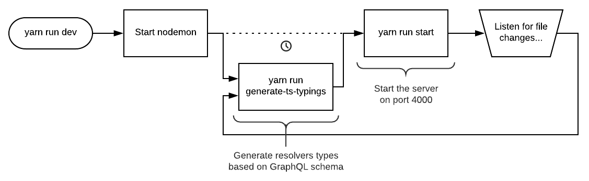

# graphql-server-with-typescript

A simple [GraphQL](https://graphql.org) server using [NodeJS](https://nodejs.org) and [TypeScript](https://www.typescriptlang.org).

[](https://graphql-server-with-typescript.httpiago.now.sh/graphql) [](https://snyk.io/test/github/httpiago/graphql-server-with-typescript) 

## About

Currently, in 2019, to create a GraphQL API it's necessary to write a [schema](https://graphql.org/learn/schema/) with the types of inputs and outputs of server, which is usually defined in a text file called `schema.graphql`. That is not a problem for applications that use pure JavaScript, but it can create a headache if you want to use [TypeScript](https://www.typescriptlang.org/) to ensure code type-safety, because TS-compiler can't infer typings inside text file and the developer need to manually sync the GraphQL schema with TypeScript types and **this is NOT productive**.

## Solutions

Some time ago, I [tried to create a server](https://github.com/httpiago/graphql-and-typescript-legacy) using a package called "[type-graphql](https://github.com/19majkel94/type-graphql)" which aims to automate the creation of the schema based on code writed using [decorators](https://www.typescriptlang.org/docs/handbook/decorators.html). I reached my goal and I was pleased with the result, but now I found some problems looking at the code: decorators are not a standard yet, the code gets more verbose and difficult for other developers to maintain and the package in question still needs to be improved.

Anyway, with this project I want to try the reverse approach: automate the creation of code typings based on GraphQL schema and this time I will use another package called "[graphql-codegen](https://github.com/dotansimha/graphql-code-generator)".

## Installation

```bash
git clone https://github.com/httpiago/graphql-server-with-typescript.git
cd graphql-server-with-typescript
yarn install
```

and start the server:

```bash
yarn run dev
```

## Workflow



## Security

Some security barriers have been implemented on this server to prevent abuse and malicious queries:

##### Query deep limit

There is a limit to how deep a query can be and if it is greater than 5, an error is returned. [See implementation](https://github.com/httpiago/graphql-server-with-typescript/blob/4138f6ef17ded0709a89302129e3e81faa5fa59f/src/index.ts#L32).
Here's an example of how to calculate depth:

```graphql
query GetUserAndHisTweets { // 0
  user(id: "5") { // 1
    username
    photo
    tweets { // 2
      edges { // 3
        node { // 4
          content
          createdAt
        }
      }
    }
  }
}
```

#### Query complexity limit

Some properties and mutations are more expensive than others and it's a good practice assign a complexity cost to them so the server can sum and check if queries exceeded the cost limit before they are actually executed. [See implementation](https://github.com/httpiago/graphql-server-with-typescript/blob/4138f6ef17ded0709a89302129e3e81faa5fa59f/src/index.ts#L34) and [how to define the cost](https://github.com/httpiago/graphql-server-with-typescript/blob/4138f6ef17ded0709a89302129e3e81faa5fa59f/src/types/User.graphql#L51).

#### Authentication System

All mutations require a [JWT token](https://jwt.io/) to determine which user is trying to perform the action. To acquire this token you need to call the `auth` mutation. See [how to generate the token](https://github.com/httpiago/graphql-server-with-typescript/blob/4138f6ef17ded0709a89302129e3e81faa5fa59f/src/resolvers/user.ts#L36) and [how to verify if there is an authenticated user in the request](https://github.com/httpiago/graphql-server-with-typescript/blob/4138f6ef17ded0709a89302129e3e81faa5fa59f/src/resolvers/user.ts#L61).

#### Token access permissions

It's possible define which places a token is allowed access and prevent all generated tokens from having access to everything in the api. See [how to define token scope](https://github.com/httpiago/graphql-server-with-typescript/blob/4138f6ef17ded0709a89302129e3e81faa5fa59f/src/common/functions.ts#L45) and [how to check if they have access](https://github.com/httpiago/graphql-server-with-typescript/blob/4138f6ef17ded0709a89302129e3e81faa5fa59f/src/resolvers/user.ts#L81).

#### Only allow access to certain types of users

Another good practice is to determine what type of user has access to a certain part of server, for example, only a moderator can approving posts and only an administrator can banning users. [This file](https://github.com/httpiago/graphql-server-with-typescript/blob/master/src/common/permissions.ts) contains all available checks and [here is an example usage](https://github.com/httpiago/graphql-server-with-typescript/blob/4138f6ef17ded0709a89302129e3e81faa5fa59f/src/resolvers/tweet.ts#L94).

## Pagination

To traverse the connections, a cursor-based pagination was implemented on this server. Example:

```graphql
query GetLatestTweets {
  tweets(first: 20, after: "cursor") {
    edges {
      cursor
      node {
        id
        content
        createdAt
      }
    }
    pageInfos {
      endCursor
      hasNextPage
      hasPreviousPage
    }
  }
}
```

[You can read more about GraphQL connections here](https://blog.apollographql.com/explaining-graphql-connections-c48b7c3d6976).

## Custom scalars

The package [graphql-scalars](https://github.com/Urigo/graphql-scalars) has been installed to provides some custom [scalars](https://graphql.org/learn/schema/#scalar-types) to make explicit what the field is about and also validate the inputs.

To add a new scalar, just set it in [Root.graphql](src/types/Root.graphql):

```diff
 scalar DateTime
 scalar URL
+scalar PositiveInt
....
```

Register its resolver in the [resolvers/index.ts](src/resolvers/index.ts) file:

```diff
-import { DateTimeResolver, URLResolver } from 'graphql-scalars'
+import { DateTimeResolver, URLResolver, PositiveIntResolver } from 'graphql-scalars'

const customScalarsResolvers = {
   DateTime: DateTimeResolver,
   URL: URLResolver,
   // The key must have the same scalar name defined in the previous step.
+  PositiveInt: PositiveIntResolver,
}
...
```

And define its type ([valid in TypeScript](https://www.typescriptlang.org/docs/handbook/basic-types.html)) in [this configuration file](codegen.yml) so graphql-codegen can correctly create type of resolvers (if you don't do this step, the type of arguments and fields with custom scalar will be "any").

```diff
...
    config:
      scalars:
        DateTime: Date
        URL: string
+       PositiveInt: number
...
```

## Inspirations

- [GitHub GraphQL API](https://developer.github.com/v4/)
- [Spectrum server](https://github.com/withspectrum/spectrum)
- [GraphQL website](https://graphql.org/)
